# MiliMili

## 1. M站简介

咪哩咪哩免费提供用户观看各种视频资源，影视番剧，同时也有论坛区提供用户与用户之间交流，Up主可上传自制视频或者搬运其他视频。咪哩咪哩用于分享各种视频、影视番剧，现受广大用户青年的热爱与青睐，主要是用来休闲娱乐的一个网站。

## 2.数据库设计

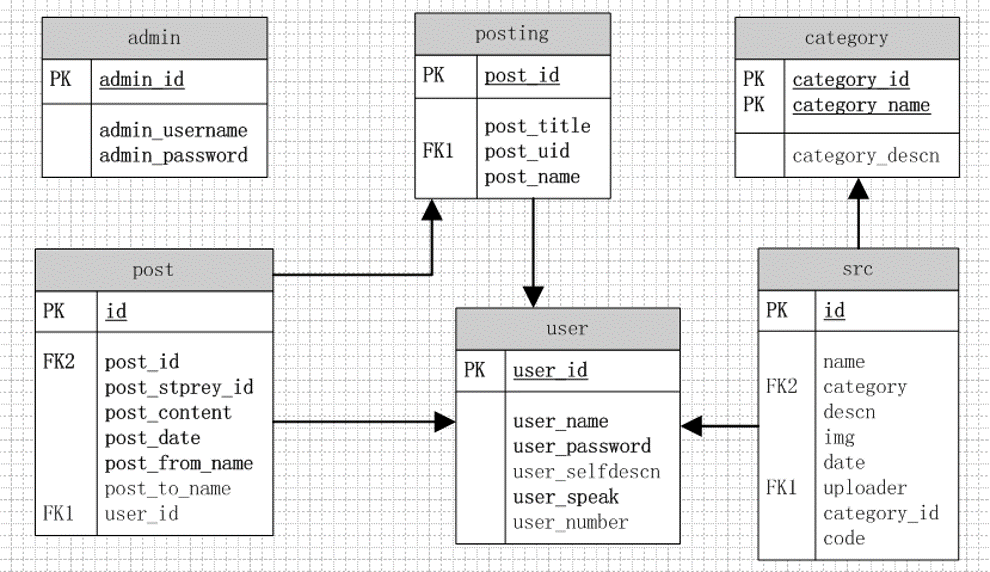

## 3.功能模块

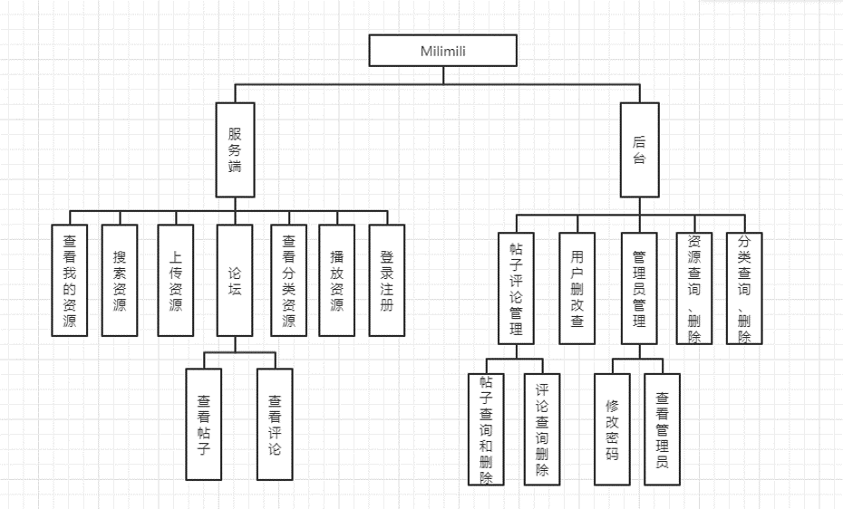

## 4.运行效果

### 4.1.客户端

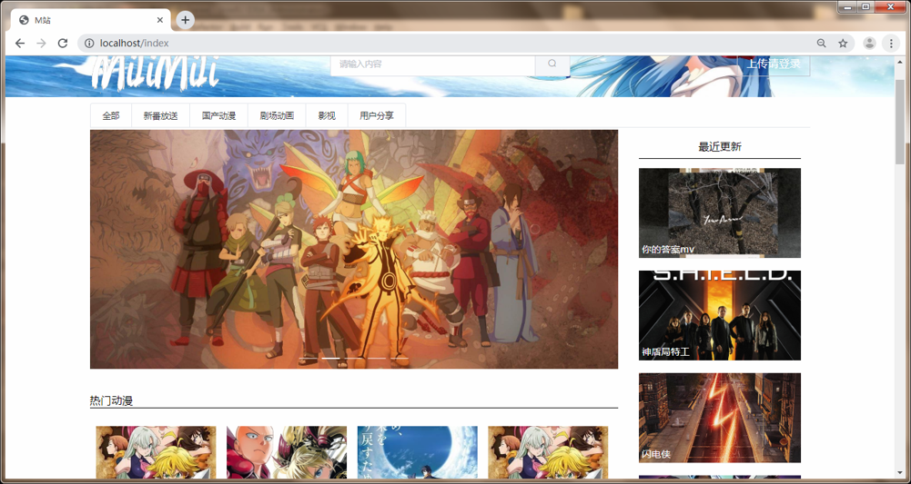

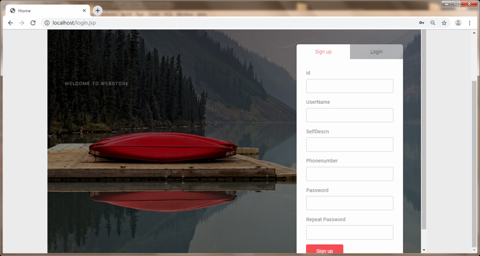

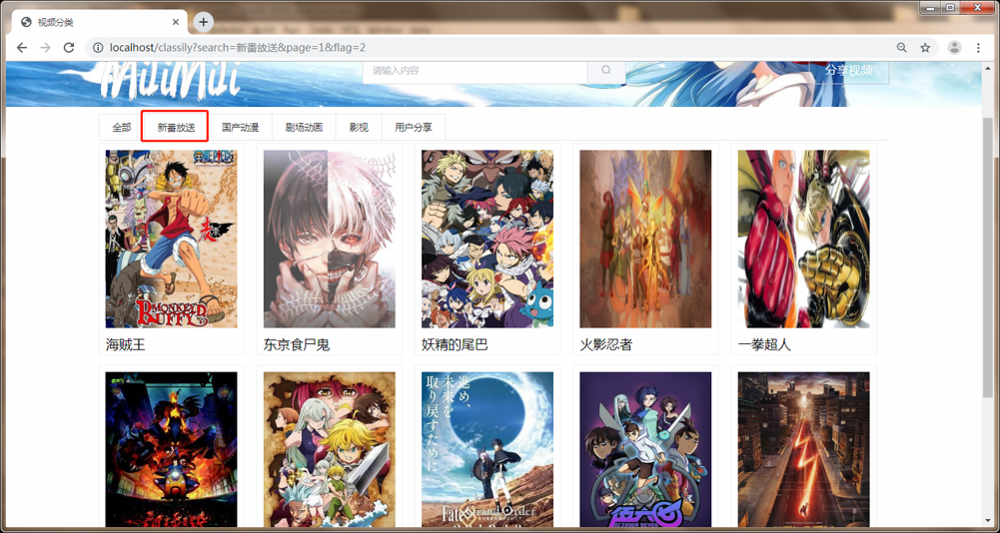

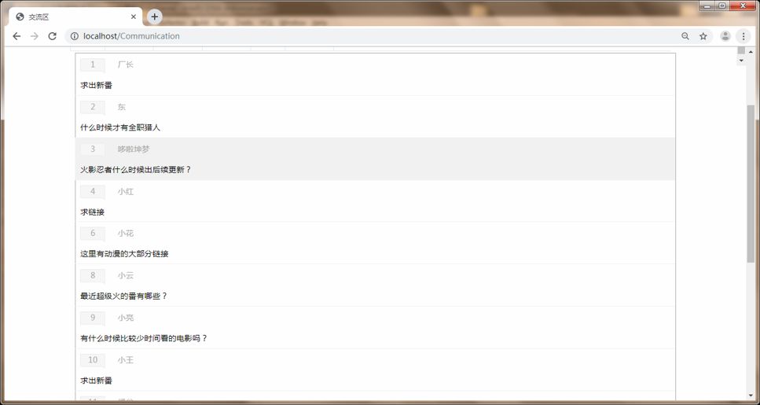

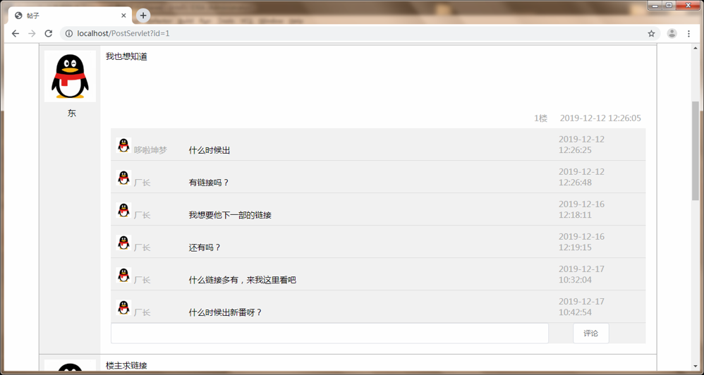

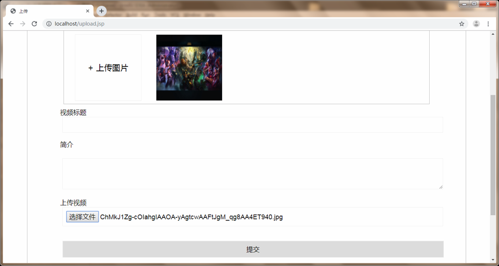

### 4.2.后台管理系统

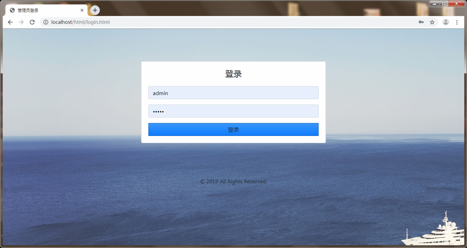

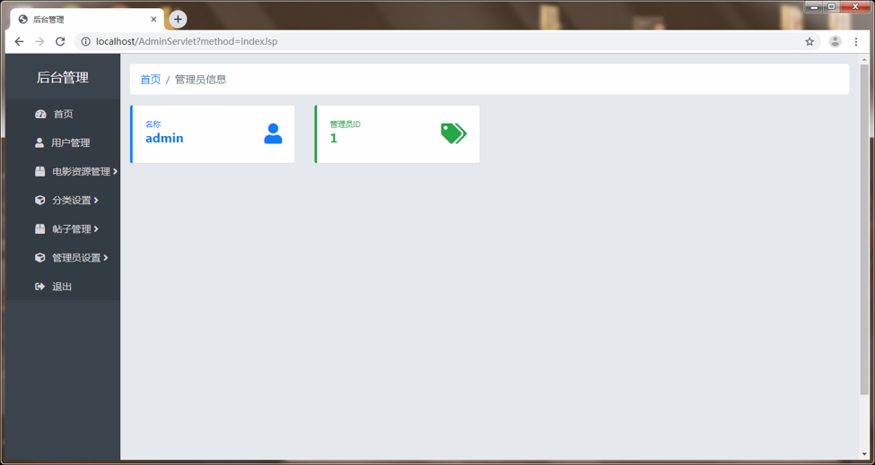

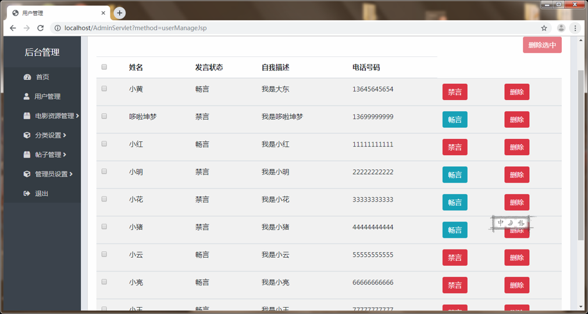

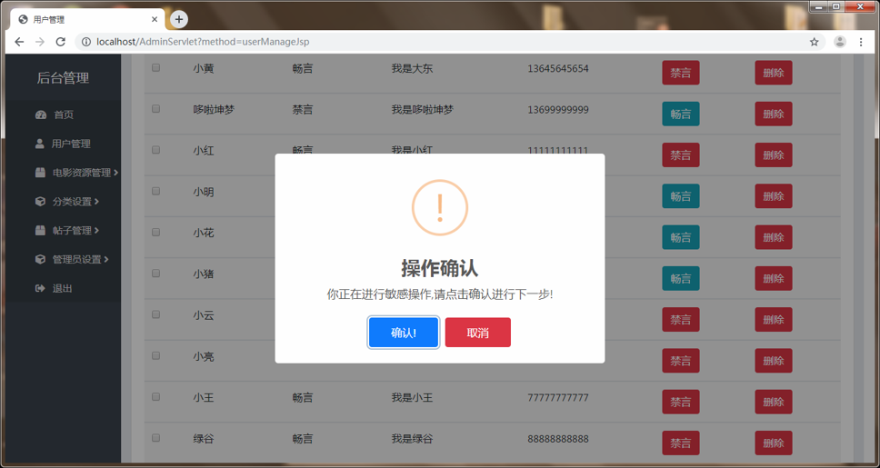

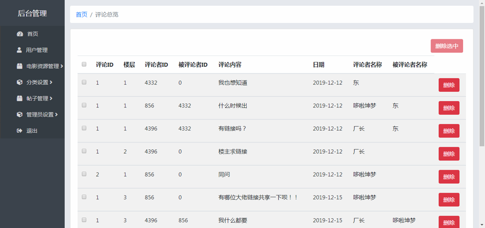

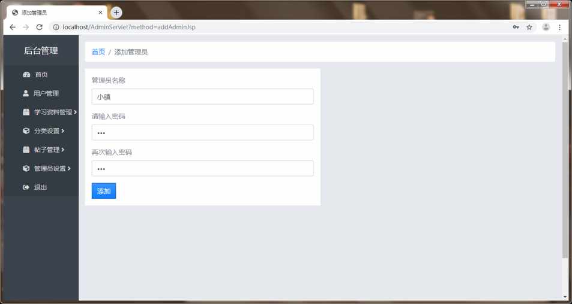

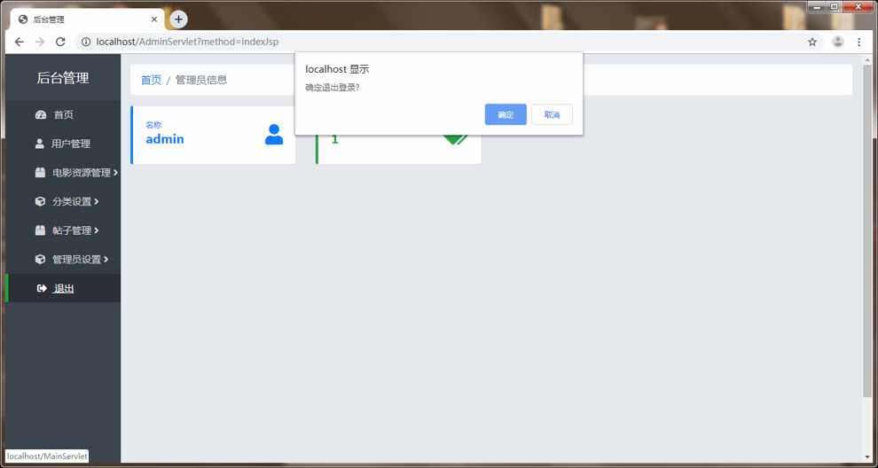

## 5.关键技术

* 客户端的前端UI框架采用element，后台管理系统的前端UI框架采用bootstrap，快速搭建简便美观的界面
* 采用前端vue框架，使用条件渲染、数据绑定、组件等功能，简化前端代码的实现
* 传统的网页更新网页内容时要重新加载页面来重写页面，这工作量无疑是巨大的，我们采用ajax技术，实现异步输入输出，局部更新，减轻页面重载数据的压力
* 使用JdbcTemplate, 简化了资源的建立和释放,我们只需要提供SQL语句和提取结果,使JDBC更加易于使用
* 采用DRUID连接池技术，它结合了C3P0、DBCP、PROXOOL等DB池的优点，同时加入了日志监控，可以很好的监控DB池连接和SQL的执行情况
* 采用BeanUtils，帮助我们把属性封装到javabean对象的对应属性，方便对Bean类能够进行简便的操作

## 6.备注

本项目由本人和其他俩个同学共同开发，本人负责的是客户端的前端页面